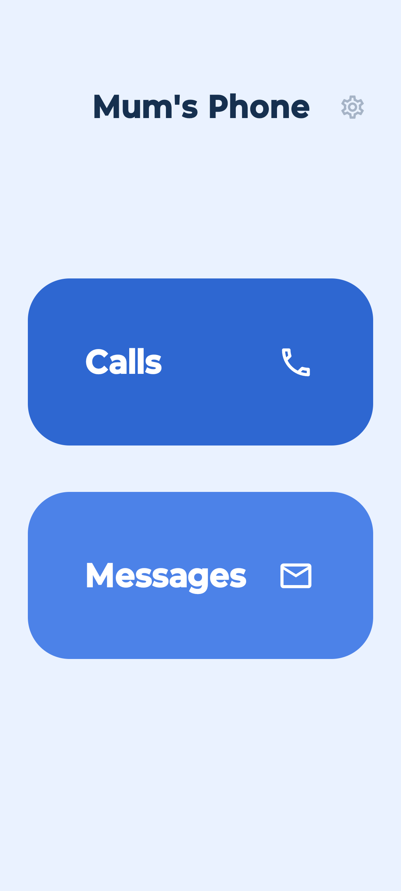
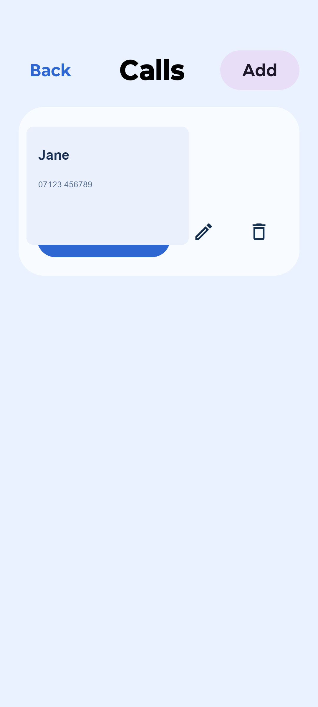
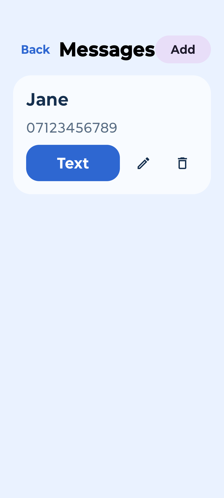

# Mum Launcher

An Android launcher built around one real problem: smartphones are too complicated for some people, and the people who look after them need an easy way to hand the phone back to normal.

The app has three layers:

- **Simple mode** — a large-button home screen with only Calls and Messages. This is what the person being supported sees.
- **Standard mode** — a curated app grid for scheduled off-session time. Not yet built.
- **Native launcher** — one tap in admin hands the phone back to the original launcher for full use. Home always returns to Mum Launcher.

## Current state

Simple mode is complete and functional. Standard mode and scheduling are next. Tested on a Motorola Moto G85 running Android 15.

The app name is under discussion — working name is **Dial It Back**.

## What it does now

- Replaces the Android home screen. Home button always returns here.
- Shows Calls and Messages on the home screen with large, obvious buttons.
- Stores contacts locally inside the app.
- Uses the system Phone and Messages apps for actual call/SMS handling.
- Admin area behind a PIN (triple-tap the cog). No PIN required until one is set.
- Detects the previous default launcher during setup and stores it.
- Admin can hand the phone back to the native launcher in one tap.
- Pins a home screen shortcut during setup so carers can return easily.

## Local setup

1. Install JDK 17.
2. Install Android Studio (or just the Android SDK command-line tools).
3. Enable Developer Options and USB debugging on the target phone.

If you prefer the terminal:

```bash
export JAVA_HOME="/opt/homebrew/opt/openjdk@17/libexec/openjdk.jdk/Contents/Home"
export PATH="$JAVA_HOME/bin:$PATH"
```

Then build and install:

```bash
./gradlew installDebug
```

To clear app data for a fresh setup run:

```bash
adb shell pm clear com.daveharris.mumlauncher
```

## Build outputs

- Debug APK: `app/build/outputs/apk/debug/app-debug.apk`
- Release APK: `app/build/outputs/apk/release/app-release.apk`

The release build is signed with the debug keystore for convenience. Replace that before any store distribution.

## Screenshots

| Launcher | Calls | Messages |
| --- | --- | --- |
|  |  |  |

## Privacy

Contacts and settings are stored locally on the device. No analytics, accounts, or cloud sync.

See [PRIVACY.md](PRIVACY.md).
